# <div align="center">From Reviews to Insights: Leveraging Confluent, MongoDB, and AWS</div>

## Overview
This project showcases a scalable and modern architecture for detecting and filtering review bombing activities in real-time, leveraging the power of Confluent, AWS, and MongoDB. The setup processes Amazon review data to identify fake reviews and integrate valid reviews with user account information. Furthermore, we utilize Amazon Bedrock to categorize the reviews into interesting categories and generate review summaries.

## Agenda
1. [Launch Confluent Cloud and set up your cluster](#step-1)
2. [Prepare Flink, Kafka topics and API keys](#step-2)
3. [Set up AWS resources for review data using terraform](#step-3)
4. [Configure MongoDB Atlas for user data](#step-4)
5. [Establish a source connector to MongoDB](#step-5)
6. [Using Flink for real-time data stream processing.](#step-6)
7. [Trigger downstream GenAI applications](#step-7)
8. [Clean up and decommission resources post-analysis](#step-8)

## Prerequisites

To ensure a smooth and successful experience with this demo, please make sure you have the following tools and accounts set up:

- **Confluent Cloud Account**: You'll need a Confluent Cloud account. If you don't have one, you can sign up for a free trial [here](https://www.confluent.io/confluent-cloud/tryfree/).
    - After verifying your email address, access Confluent Cloud sign-in by navigating [here](https://confluent.cloud).
    - When provided with the _username_ and _password_ prompts, fill in your credentials.
    
- **Terraform**: If you don't already have Terraform installed, you can find installation instructions [here](https://developer.hashicorp.com/terraform/tutorials/aws-get-started/install-cli).

- **AWS Cli**: You'll need AWS cli installed and configured on your system. You can download it from the official website [here](https://docs.aws.amazon.com/cli/latest/userguide/getting-started-install.html). Set up your AWS CLI using the `aws configure` command.

- **Python 3.11**: Ensure you have python 3.11 version installed.

- **MongoDB Atlas Account**: Create a MongoDB Atlas account and set up a free cluster. You can follow the Atlas UI instructions given below

    - [Create Atlas account](https://www.mongodb.com/docs/atlas/tutorial/create-atlas-account/)
    - [Create a cluster](https://www.mongodb.com/docs/atlas/tutorial/deploy-free-tier-cluster/)
    - [Create Database User/Password](https://www.mongodb.com/docs/atlas/security-add-mongodb-users/)
    - [Configure MongoDB Atlas Network Access](https://www.mongodb.com/docs/atlas/security/ip-access-list/). For demo purposes, you can allow from anywhere. Otherwise, you can find a list of Confluent Cloud IP addresses by following this [documentation](https://docs.confluent.io/cloud/current/networking/static-egress-ip-addresses.html)


- **Clone this repo repository**

With these prerequisites in place, you'll be ready to explore and run the demo seamlessly.

## <a name="step-1"></a>**Launch Confluent Cloud and set up your cluster**
1. Log in to [Confluent Cloud](https://confluent.cloud) and enter your email and password.
2. If you are logging in for the first time, you will see a self-guided wizard that walks you through spinning up a cluster. Please minimize this as you will walk through those steps in this guide. 
3. Click **+ Add Environment**. Specify an **Environment Name** and choose the Essentials Stream Governance package and Click **Create**. 

<div align="center" padding=25px>
    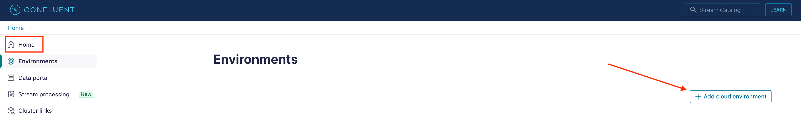
</div>
<div align="center" padding=25px>
    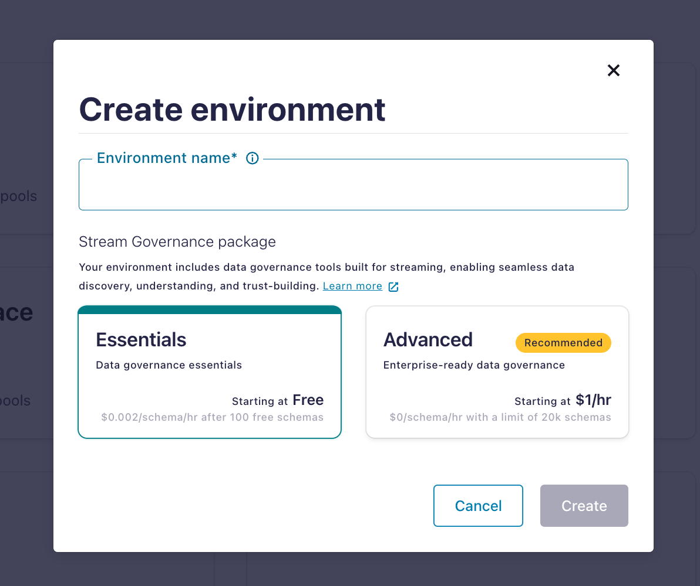
</div>

2. Now that you have an environment enabled with basic Stream Governance essentials which includes Schema Registry. Now click **Create Cluster**. 

    > **Note:** Learn more about the different types of clusters and their associated features and limits, refer to this [documentation](https://docs.confluent.io/current/cloud/clusters/cluster-types.html). Here we will use Basic Cluster for our purpose.

3. Choose the **Basic** Cluster Type. 

<div align="center" padding=25px>
    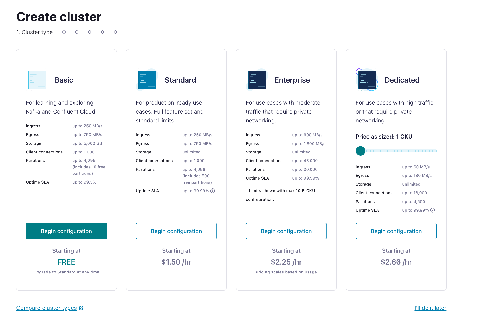
</div>

4. Click **Begin Configuration**.
5. Choose AWS Cloud Provider, Region, and Availability Zone.
     * **Select the same region where you plan to deploy your resources in the upcoming steps.**
<div align="center" padding=25px>
    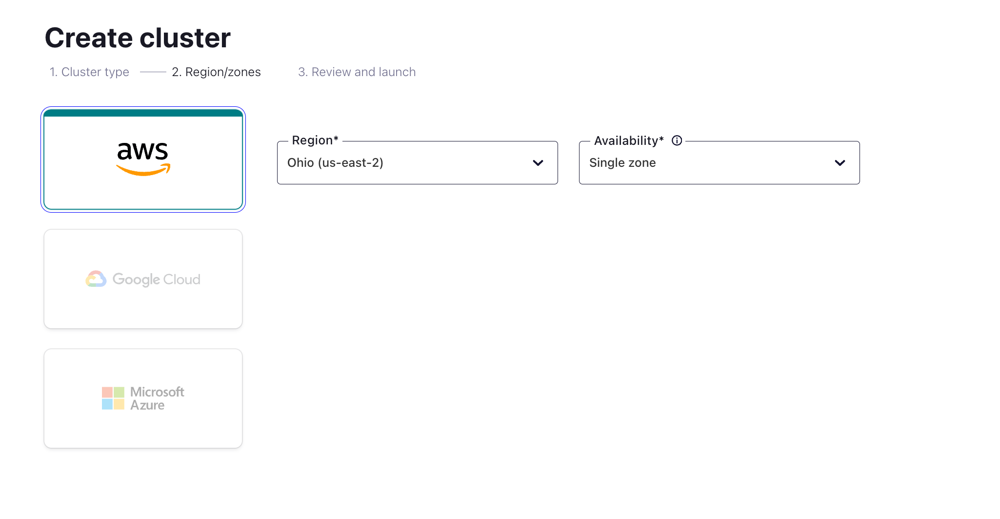
</div>

6. Specify a **Cluster Name** - any name will work here. 

7. View the associated Configuration & Cost, Usage Limits, and Uptime SLA information before launching.

8. Click **Launch Cluster.**

## <a name="step-2"></a>**Prepare Flink, Kafka topics and API keys**
1. Create a Flink workspace by navigating to the cluster view of the environment and selecting the Flink section. Follow the steps as demonstrated below
<div align="center" padding=25px>
    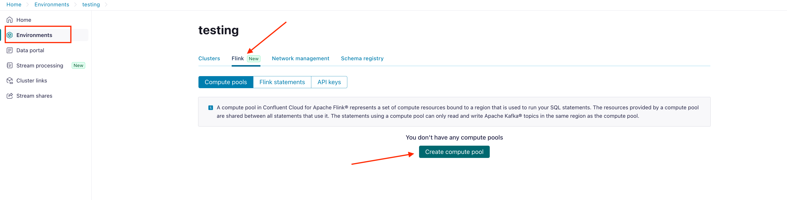
</div>
<div align="center" padding=25px>
    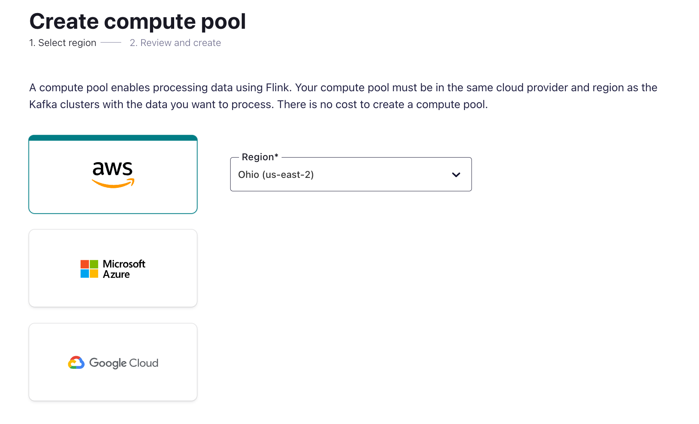
</div>
<div align="center" padding=25px>
    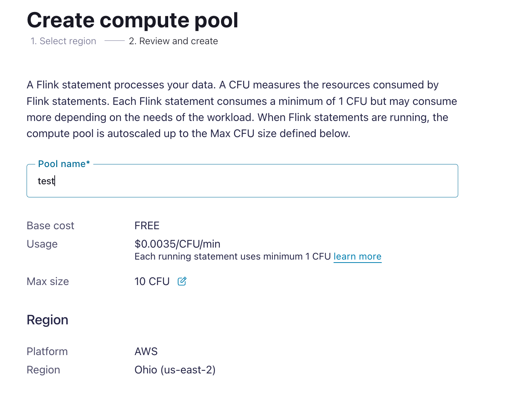
</div>

2. You can also access the Flink workspace from the left most pane by clicking `Stream Processing` option.
3. Execute the following queries in the editor to create the tables.

    > **Note:** Run each query in a new editor window. To create a new editor, click the + button near the left side of the editor.
    ```SQL
    CREATE TABLE `amazon-reviews` (
        user_id STRING,
        rating STRING,
        title STRING,
        text STRING,
        images ARRAY<STRING>,
        asin STRING,
        parent_asin STRING,
        `timestamp` TIMESTAMP(3),
        helpful_vote INT,
        verified_purchase BOOLEAN,
        WATERMARK  FOR `timestamp` AS `timestamp` - INTERVAL '5' SECOND
    );
    ```
    ```SQL
    CREATE TABLE filtered_invalid_reviews (
        user_id STRING,
        rating STRING,
        title STRING,
        text STRING,
        images ARRAY<STRING>,
        asin STRING,
        parent_asin STRING,
        `timestamp` TIMESTAMP(3),
        helpful_vote INT,
        verified_purchase BOOLEAN,
        window_start TIMESTAMP(3),
        window_end TIMESTAMP(3),
        review_count BIGINT,
        WATERMARK  FOR `timestamp` AS `timestamp` - INTERVAL '5' SECOND
    );
    ```
    ```SQL
    CREATE TABLE filtered_valid_reviews (
        user_id STRING,
        rating STRING,
        title STRING,
        text STRING,
        images ARRAY<STRING>,
        asin STRING,
        parent_asin STRING,
        `timestamp` TIMESTAMP(3),
        helpful_vote INT,
        verified_purchase BOOLEAN,
        window_start TIMESTAMP(3),
        window_end TIMESTAMP(3),
        review_count BIGINT,
        WATERMARK  FOR `timestamp` AS `timestamp` - INTERVAL '5' SECOND
    );
    ```

    ```SQL
    CREATE TABLE valid_reviews_with_user_info (
        user_id STRING,
        rating STRING,
        title STRING,
        text STRING,
        images ARRAY<STRING>,
        asin STRING,
        parent_asin STRING,
        `timestamp` TIMESTAMP(3),
        helpful_vote INT,
        verified_purchase BOOLEAN,
        window_start TIMESTAMP(3),
        window_end TIMESTAMP(3),
        review_count BIGINT,
        address STRING,
        city STRING,
        country STRING,
        email STRING,
        first_name STRING,
        gender STRING,
        last_name STRING,
        payment_method STRING,
        phone_number STRING,
        state STRING,
        zip_code STRING,
        WATERMARK  FOR `timestamp` AS `timestamp` - INTERVAL '5' SECOND
    );
    ```

4. Check the Topics section of your cluster to see the topics created. These topics are generated based on the table names specified in the queries above.

5. Create Kafka cluster API KEY aand save these values for later.
<div align="center" padding=25px>
    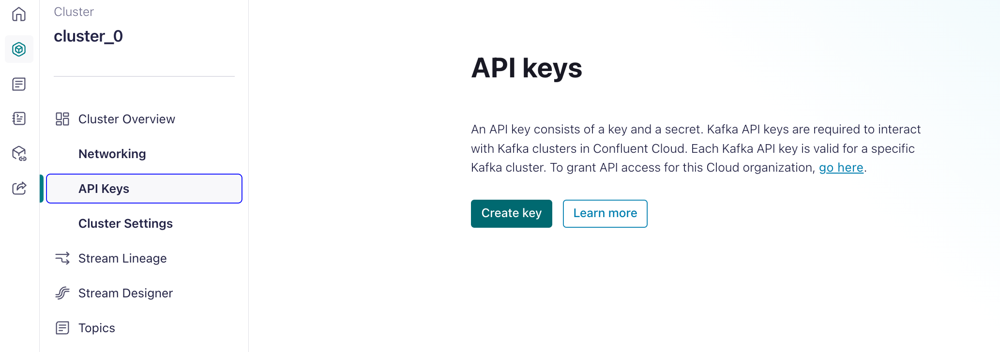
</div>
<div align="center" padding=25px>
    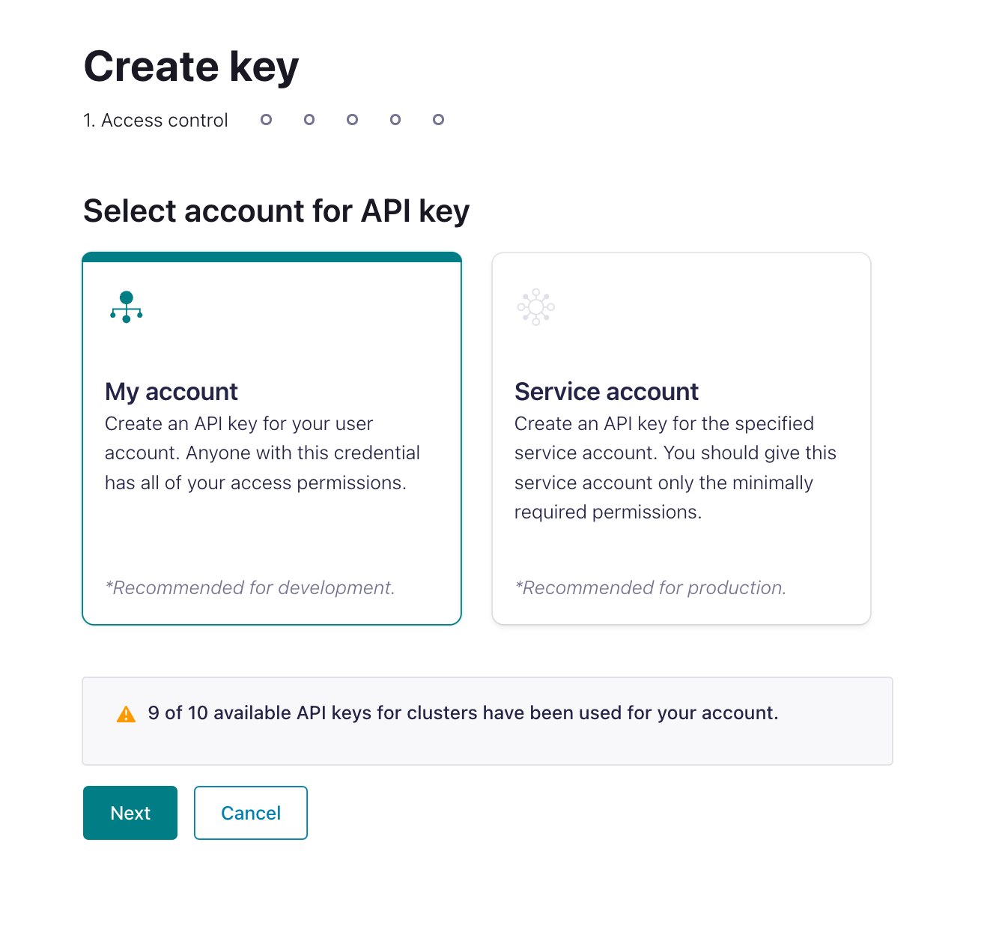
</div>

6. Create a Schema Registry API key by navigating to the right pane in the cluster's view of the environment. Save the Schema Registry URL and generate the API key by clicking the "Add Key" button. Save the endpoint and credentials for the next step. 
<div align="center" padding=25px>
    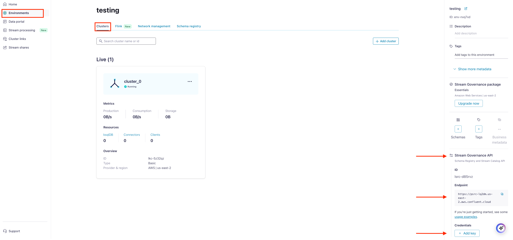
</div>
<div align="center" padding=25px>
    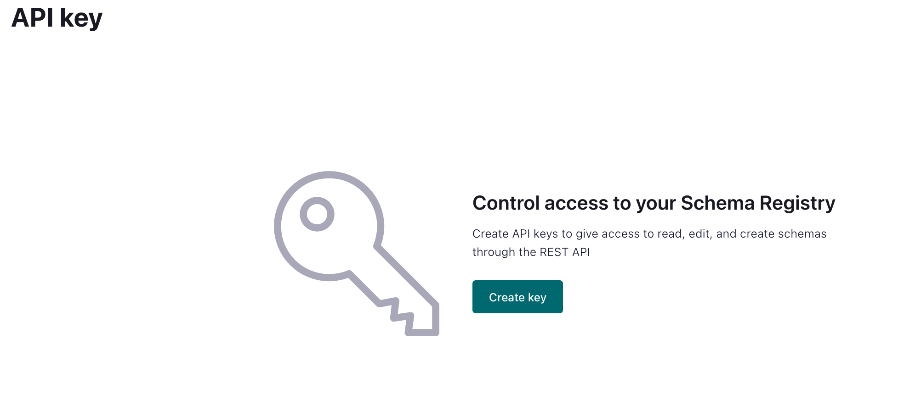
</div>

7. Get the bootstrap endpoint from the Cluster Settings and save it for the next step.
<div align="center" padding=25px>
    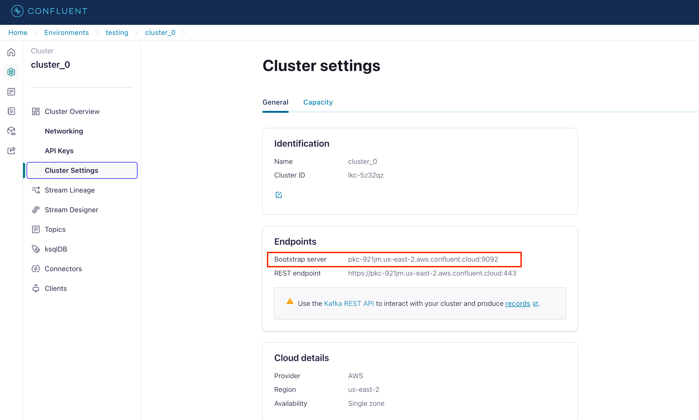
</div>

## <a name="step-3"></a>**Set up AWS resources for review data using terraform**
1. This demo uses Terraform  to spin up AWS resources that are needed. Update the `variables.auto.tfvars` file with the values you've created/gathered.
        
    - **sr_url**: this is your Stream Governance API Endpoint
    - **sr_cred**: this is your Schema Registry Key and Secret concatenated in the following pattern: `<your_schema_registry_key>:<your_schema_registry_secret>`. 
    - **kafka_api_key**: value created during step 5
    - **kafka_api_secret**: value created during step 5
    - **bootstrap_server**: value found in step 7
    - **aws_profile**: this is the AWS profile name that you use for AWS CLI. You may leave as `default` or change to a specifed name
    - **bucket_name**: create globally unique name
    - **mongo_uri**: You will need 3 things from MongoDB to create this. Your MongoDB Atlas endpoint, your database username, and your database password. The connection string/value will have the following format: `mongodb+srv://<database_user>:<database_password>@<your_cluster_endpoint>`
    Here is an example uri/connection string:
    `mongodb+srv://<db_username>:<db_password>@cluster0.nza3jt8.mongodb.net` 
    - **secret_name**: you may leave as `genai_demo_secret` or change
        
1. Initialize Terraform.
    ```
    terraform init
    ```

1. Preview the actions Terraform would take to modify your infrastructure or Check if there are any errors in the code.
    ```
    terraform plan
    ```

1. Apply the plan to create the infrastructure.

    ```
    terraform apply 
    ```
7. Verify the resources created by terraform in AWS.
8. Execute the `upload-datasets-to-s3.py` script located in the `scripts` folder using the following command:
    ```
    python3 upload-datasets-to-s3.py
    ```
9. Check the datasets uploaded to S3 by the script.
10. Open the AWS Step Functions that were created and start the execution:
    - The Step Function `confluent-mongo-aws-state-function-1` will trigger the valid reviews Lambda function, running every 5 seconds to generate valid reviews.
    - The Step Function `confluent-mongo-aws-state-function-2` will trigger the review bombing Lambda function, running every 3 minutes to generate 1,000 fake reviews.
    - The Step Function `confluent-mongo-aws-state-function-3` will trigger the static review bombing Lambda function, running every 25 seconds to generate static fake reviews.
<div align="center" padding=25px>
    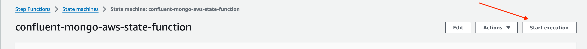
</div>
<div align="center" padding=25px>
    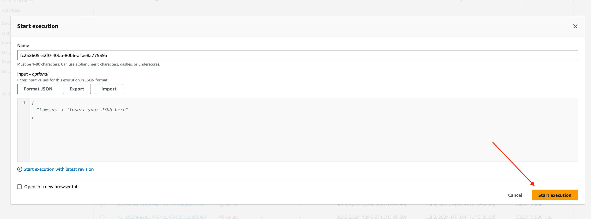
</div>

11. Observe the data being populated in the `amazon-reviews` topic that we set up in Confluent Cloud.
<div align="center" padding=25px>
    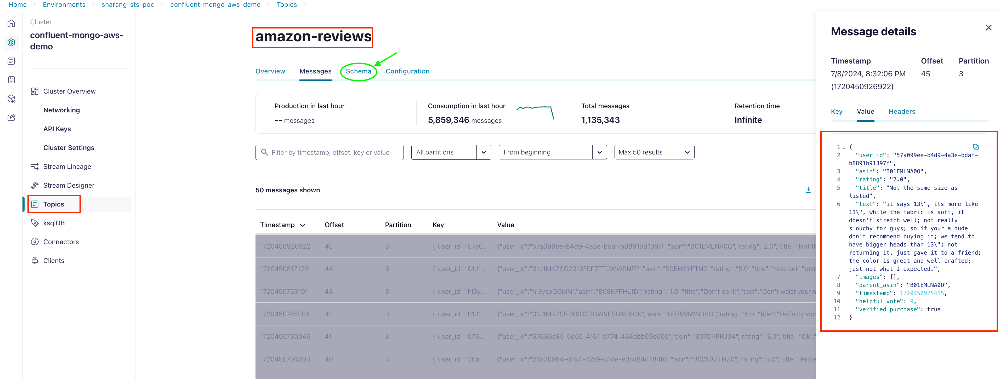
</div>

## <a name="step-4"></a>**Configure MongoDB Atlas for user data**
- Create a database and collection in the cluster from the prerequisites. Click the "Insert Document" option, switch to code view, and paste the entire content from the `data/amazon-user-mockdata.json` file. This will populate the collection with user accounts.
<div align="center" padding=25px>
    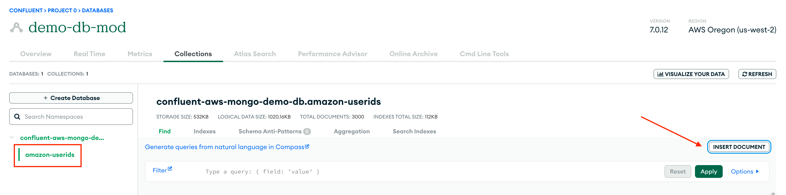
</div>
<div align="center" padding=25px>
    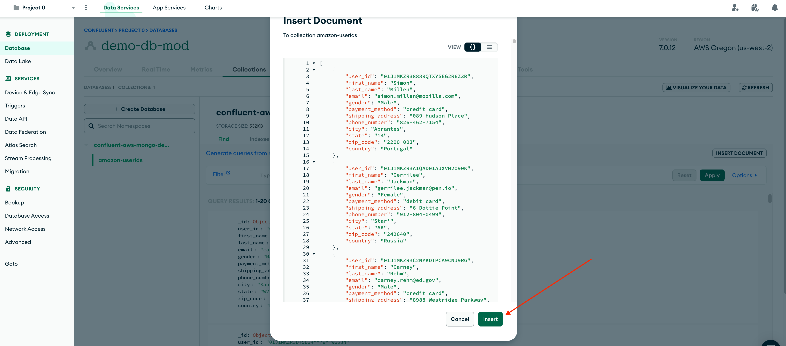
</div>

## <a name="step-5"></a>**Establish a source connector to MongoDB**
1. Go to the `Connectors` section in the left pane, search for the `MongoDB Atlas Source` connector, and select it.
<div align="center" padding=25px>
    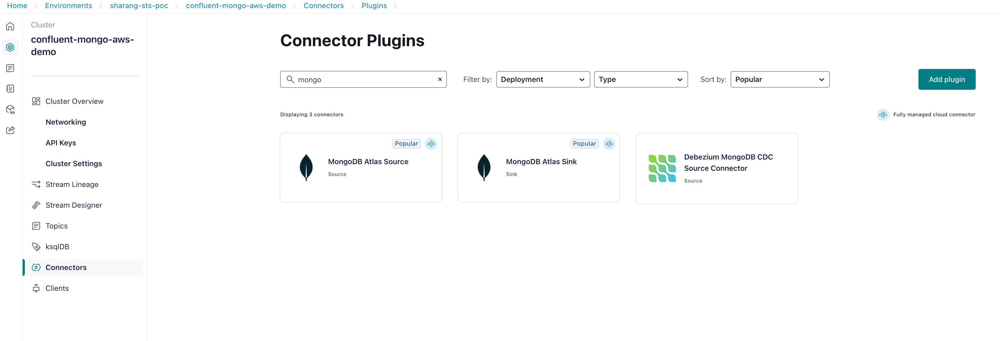
</div>

2. Provide a prefix for the topic that will be created by the MongoDB source connector.
<div align="center" padding=25px>
    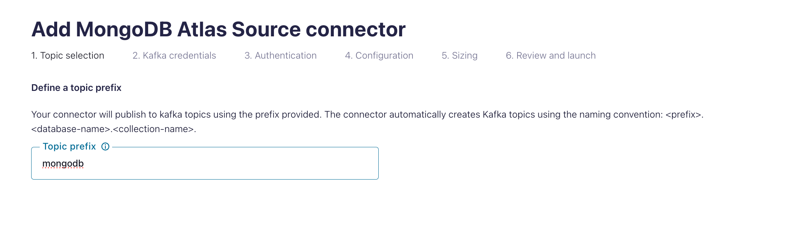
</div>

3. Enter the API key for the existing cluster created in the previous steps or generate a new Kafka cluster API key.
4. Provide Atlas credentials in the authentication step
<div align="center" padding=25px>
    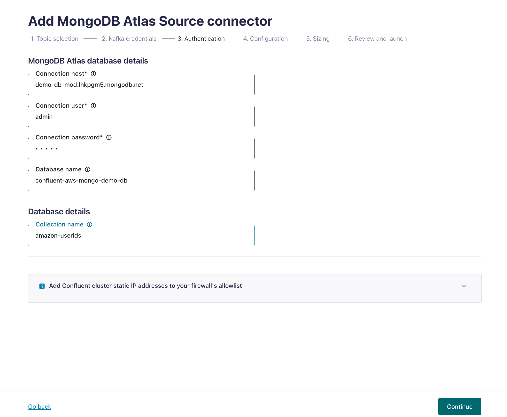
</div>

5. The verification step will be successful if Confluent can connect to MongoDB Atlas using the provided credentials.
6. Configure your connector as demonstrated, and leave the remaining settings unchanged.
<div align="center" padding=25px>
    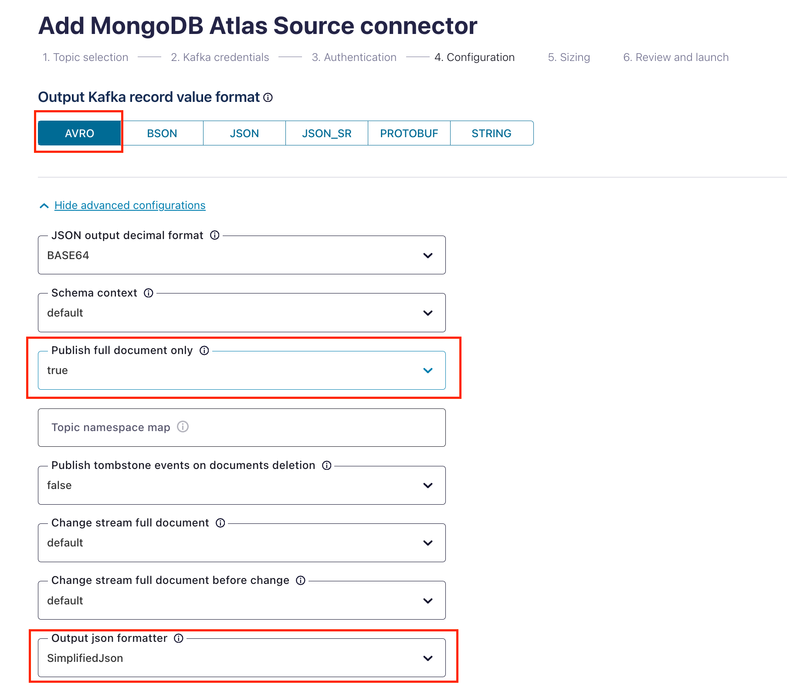
</div>
<div align="center" padding=25px>
    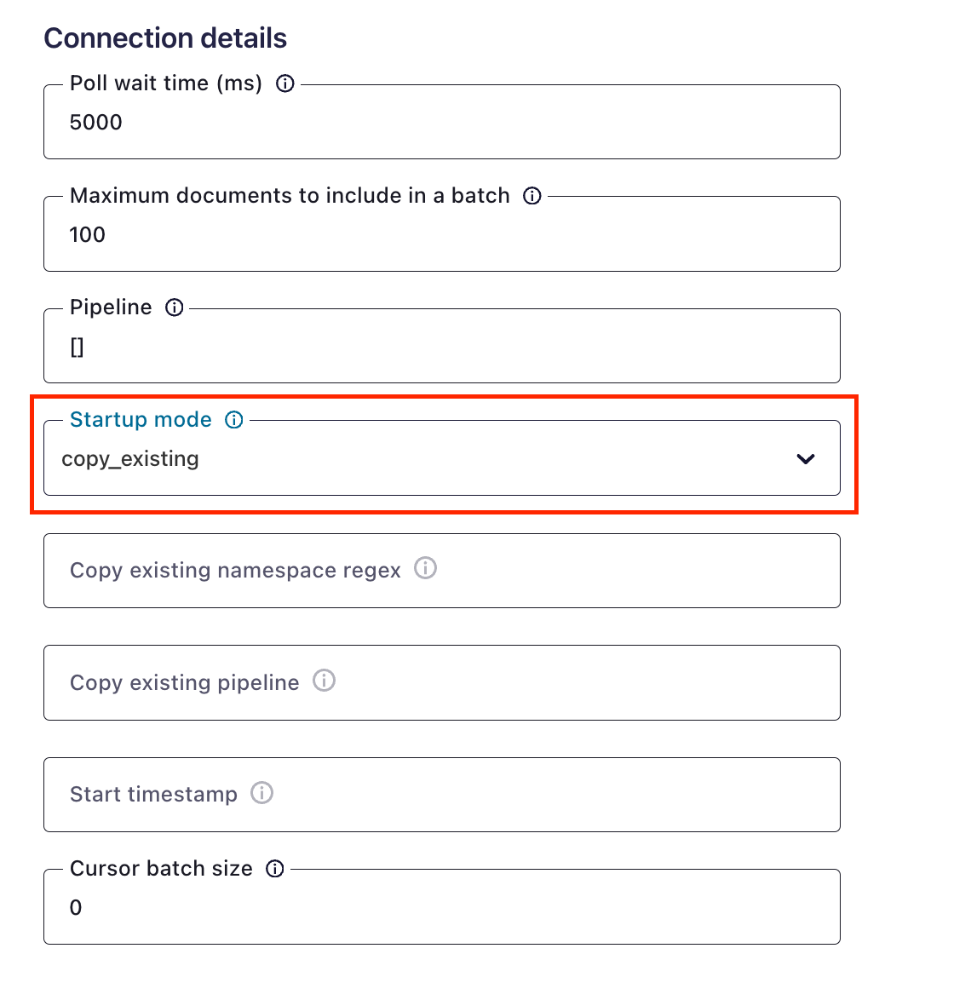
</div>

7. Review and launch the connector. Once it is successfully running, you will see a new topic created in the Topics section and user account data populated within the topic.

## <a name="step-6"></a>**Using Flink for real-time data stream processing.**

1. Execute the following queries to perform a review filter operation, separating reviews into valid and invalid categories. The filtering is based on a hopping window action, where any sudden spike of negative reviews from a single user ID within a short time frame will be classified as an invalid review.
    > **Note:** Run each query in a new editor window. To create a new editor, click the + button near the left side of the editor.
    ```SQL
    INSERT INTO filtered_invalid_reviews (
        user_id,
        rating,
        title,
        text,
        images,
        asin,
        parent_asin,
        `timestamp`,
        helpful_vote,
        verified_purchase,
        window_start,
        window_end,
        review_count
    )
    SELECT
        ar.user_id,
        ar.rating,
        ar.title,
        ar.text,
        ar.images,
        ar.asin,
        ar.parent_asin,
        ar.`timestamp`,
        ar.helpful_vote,
        ar.verified_purchase,
        rc.window_start,
        rc.window_end,
        rc.review_count
    FROM (
        SELECT
            user_id,
            window_start,
            window_end,
            COUNT(*) AS review_count
        FROM TABLE(
            HOP(TABLE `amazon-reviews`, DESCRIPTOR(`timestamp`), INTERVAL '1' MINUTES, INTERVAL '4' MINUTES))
        GROUP BY window_start, window_end, user_id
    ) rc
    JOIN `amazon-reviews` ar
        ON ar.user_id = rc.user_id
        AND ar.`timestamp` >= rc.window_start
        AND ar.`timestamp` < rc.window_end
    WHERE rc.review_count >= 10
    AND ar.verified_purchase = false;
    ```

    ```SQL
    INSERT INTO filtered_valid_reviews (
        user_id,
        rating,
        title,
        text,
        images,
        asin,
        parent_asin,
        `timestamp`,
        helpful_vote,
        verified_purchase,
        window_start,
        window_end,
        review_count
    )
    SELECT
        ar.user_id,
        ar.rating,
        ar.title,
        ar.text,
        ar.images,
        ar.asin,
        ar.parent_asin,
        ar.`timestamp`,
        ar.helpful_vote,
        ar.verified_purchase,
        rc.window_start,
        rc.window_end,
        rc.review_count
    FROM (
        SELECT
            user_id,
            window_start,
            window_end,
            COUNT(*) AS review_count
        FROM TABLE(
            HOP(TABLE `amazon-reviews`, DESCRIPTOR(`timestamp`), INTERVAL '1' MINUTES, INTERVAL '4' MINUTES))
        GROUP BY window_start, window_end, user_id
    ) rc
    JOIN `amazon-reviews` ar
        ON ar.user_id = rc.user_id
        AND ar.`timestamp` >= rc.window_start
        AND ar.`timestamp` < rc.window_end
    WHERE rc.review_count < 10
    ```
2. After the window analysis is complete, the data will be distributed into the respective topics. Verify the data within these topics, all data produced by the review bombing Lambda function will be categorized as invalid reviews.
3. Now, let's join the valid reviews with the account information.
    ```SQL
    INSERT INTO valid_reviews_with_user_info
    SELECT
        fvr.user_id,
        fvr.rating,
        fvr.title,
        fvr.text,
        fvr.images,
        fvr.asin,
        fvr.parent_asin,
        fvr.`timestamp`,
        fvr.helpful_vote,
        fvr.verified_purchase,
        fvr.window_start,
        fvr.window_end,
        fvr.review_count,
        au.address,
        au.city,
        au.country,
        au.email,
        au.first_name,
        au.gender,
        au.last_name,
        au.payment_method,
        au.phone_number,
        au.state,
        au.zip_code
    FROM filtered_valid_reviews fvr
    JOIN `mongodb.confluent-aws-mongo-demo-db.amazon-userids` au
    ON fvr.user_id = au.user_id;
    ```
4. Now, you will see the valid review data with the account information in the `valid_reviews_with_user_info` topic.


## <a name="step-7"></a>**Set up AWS Lambda Triggers**
AWS Lambda Triggers allows for events (such has a new Kafka record landing in a topic) to invoke AWS Lambda. Click [here](https://docs.aws.amazon.com/lambda/latest/dg/lambda-services.html) learn more about AWS Lambda Triggers.

### Set up the Avro Deserializer Lambda Trigger
This AWS Lambda will deserialize the Kafka records from Avro into Plaintext JSON. This kind of parsing can normally be done within each downstream AWS Lambda function, but for the purposes of this workshop, we will do it once in this function and publish the resulting JSON to a new topic called `valid_reviews_with_user_info_json`. The other downstream AWS Lambda functions will consume off of this topic.
1. Navigate to [avro_deserializer Lambda function](https://us-east-1.console.aws.amazon.com/lambda/home?region=us-east-1#/functions/avro_deserializer?tab=code).
1. Click `Add Trigger`
1. Search `Confluent` in the search box and select the `Apache Kafka` trigger.
1. Add your bootstrap server 
1. Set Starting Position to `Trim horizon`
1. Set the topic name to `valid_reviews_with_user_info`
1. Set Authentication to `BASIC_AIUTH`
1. Set Secrets Manager Key to the Secret deployed by Terraform (default name was `genai_demo_secret`)
1. Click save. 
1. After the Trigger is done deploying and is enabled, you can verify the trigger is working by navigating to the `valid_reviews_with_user_info_json` topic and viewing incoming messages. If you do not see messages, visit the CloudWatch logs of the [avro_deserializer Lambda function](https://us-east-1.console.aws.amazon.com/lambda/home?region=us-east-1#/functions/avro_deserializer?tab=monitoring) and look for any errors.


### Set up the Semantic Filter Lambda Trigger
This AWS Lambda function will find unique reviews leveraging MongoDB's [Semantic Search capability ](https://www.mongodb.com/resources/basics/semantic-search). The idea here is that reviews with fewer matches means the is unique in a variety of ways: review length, word choice, etc. These types of reviews may be prioritized to provide potential customers the most well-round information.

1. Navigate to [semantic_filter Lambda function](https://us-east-1.console.aws.amazon.com/lambda/home?region=us-east-1#/functions/semantic_filter?tab=code).
1. Set up the Kafka Trigger using the same process and settings mentioned above **_except for the topic name_**. The topic name should be `valid_reviews_with_user_info_json`
1. After the Trigger is done deploying and is enabled, you can verify the trigger is working by navigating to the `enriched_product` topic and viewing incoming messages. If you do not see messages, visit the CloudWatch logs of the [semantic_filter Lambda function](https://us-east-1.console.aws.amazon.com/lambda/home?region=us-east-1#/functions/semantic_filter?tab=monitoring) and look for any errors.

### Set up the Review Summarize Lambda Trigger
This AWS Lambda is more self-explanatory in that it summarizes the review. This summarization can be used to provide a numerical representation where one wasn't provided.

1. Navigate to [review_summarizer Lambda function](https://us-east-1.console.aws.amazon.com/lambda/home?region=us-east-1#/functions/review_summarizer?tab=code).
1. Set up the Kafka Trigger using the same settings mentinoed above **_except for the topic name_**. The topic name should be `valid_reviews_with_user_info_json` (the same topic as the `semantic_filter` AWS Lambda function)
1. After the Trigger is done deploying and is enabled, you can verify the trigger is working by navigating to the `enriched_review` topic and viewing incoming messages. If you do not see messages, visit the CloudWatch logs of the [review_summarizer Lambda function](https://us-east-1.console.aws.amazon.com/lambda/home?region=us-east-1#/functions/review_summarizer?tab=monitoring) and look for any errors.


## <a name="step-8"></a>**Clean up and decommission resources post-analysis.**
1. If you wish to remove all resources created during the demo to avoid additional charges, run the following command to execute a cleanup:
   ```bash
   terraform destroy
   ```
    This will delete all resources provisioned by Terraform.

2. Terminate all running processes such as connectors and Flink commands, then delete the cluster and environment in the Confluent Cloud UI.
3. Delete the collection and database, then remove the cluster in MongoDB Atlas.
